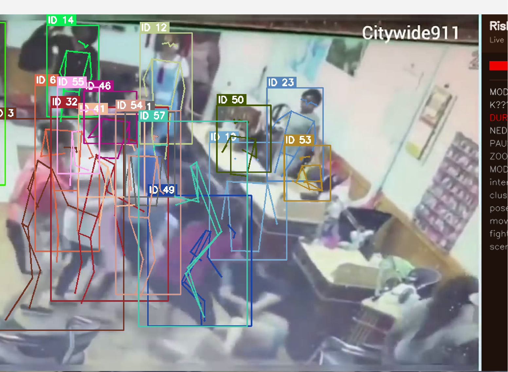
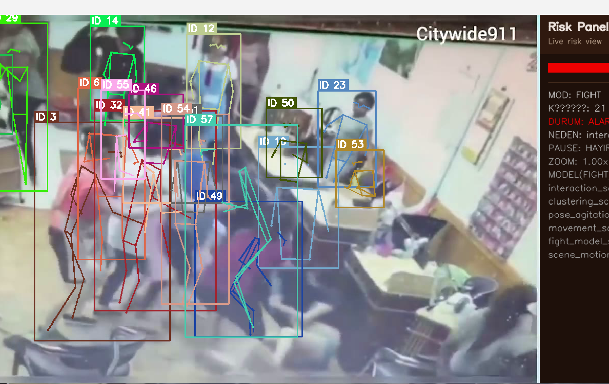

# 🎥 Kamera Tabanlı Erken Uyarı ve Video Analiz Sistemi

> Bilgisayarlı görü ve davranış analizi tekniklerini kullanarak riskli durumların erken fark edilmesini ve operatörün dikkatinin ilgili görüntüye yönlendirilmesini amaçlayan video analiz tabanlı karar destek sistemi.

Bu proje; kamera görüntülerindeki kişileri ve hareketlerini analiz ederek **agresif hareketlilik, ani çökme, uzun süreli hareketsizlik ve riskli davranış örüntüleri** gibi durumların erken fark edilmesine yardımcı olmak amacıyla geliştirilmiş bağımsız bir yazılım mühendisliği çalışmasıdır.

Sistem, görüntüden otomatik olarak kesin bir olay kararı vermek yerine birden fazla görsel sinyali değerlendirerek **açıklanabilir bir risk skoru** üretir ve operatörün dikkatini öncelikli görüntülere yönlendirmeyi amaçlar.

> [!IMPORTANT]
> Bu repository bağımsız bir bilgisayarlı görü ve yazılım mühendisliği portföy çalışmasıdır. Herhangi bir kamu kurumunun resmî kamera sistemini, güvenlik altyapısını, izleme prosedürlerini veya operasyonel yapısını temsil etmez.

---

## 🎯 Projenin Amacı

Çok sayıda kamera görüntüsünün aynı anda takip edildiği ortamlarda, her görüntünün insan tarafından kesintisiz biçimde aynı dikkat seviyesinde izlenmesi zordur.

Bu proje söz konusu problemi:

**Görüntü → Kişi/Pose Tespiti → Takip → Davranış Sinyalleri → Risk Analizi → Uyarı**

yaklaşımıyla ele almaktadır.

Sistemin cevaplamaya çalıştığı temel soru:

> **"Hangi görüntü şu anda daha fazla dikkat gerektiriyor?"**

Amaç insan operatörün yerine geçmek değil, operatörün dikkatini doğru zamanda ilgili görüntüye yönlendirebilecek bir **erken uyarı ve karar destek katmanı** oluşturmaktır.

---

## 🧠 Sistem Nasıl Çalışıyor?

Sistem başlangıçtan uyarı üretimine kadar modüler bir video analiz pipeline'ı kullanmaktadır.

```text
┌─────────────────────────┐
│      Video Kaynağı      │
│ File / Webcam / Stream  │
└────────────┬────────────┘
             │
             ▼
┌─────────────────────────┐
│        YOLO Pose        │
│   Person + Keypoints    │
└────────────┬────────────┘
             │
             ▼
┌─────────────────────────┐
│        Tracking         │
│   Temporal Movement     │
└────────────┬────────────┘
             │
             ▼
┌─────────────────────────┐
│   Feature Engineering   │
│                         │
│ • Movement              │
│ • Interaction           │
│ • Clustering            │
│ • Posture               │
│ • Inactivity            │
│ • Scene Motion          │
└────────────┬────────────┘
             │
             ▼
┌─────────────────────────┐
│       Risk Engine       │
│ Multi-Signal Analysis   │
└────────────┬────────────┘
             │
             ▼
┌─────────────────────────┐
│ NORMAL / UYARI / ALARM  │
└────────────┬────────────┘
             │
             ▼
┌─────────────────────────┐
│      Event Output       │
│ Log / Snapshot / Clip   │
└─────────────────────────┘
```

Temel işlem akışı:

1. Video kaynağından görüntü alınır.
2. YOLO Pose ile kişiler ve vücut keypoint'leri tespit edilir.
3. Tespit edilen kişiler kareler arasında takip edilir.
4. Zamana bağlı davranış özellikleri hesaplanır.
5. İlgili analiz modunun risk motoru alt sinyalleri değerlendirir.
6. Genel risk skoru ve durum seviyesi oluşturulur.
7. Gerektiğinde olay çıktıları kaydedilir.

Bu yapı sayesinde analiz bileşenleri birbirinden bağımsız olarak geliştirilebilir veya değiştirilebilir.

---

## 👁️ Kişi ve Pose Tespiti

Video kaynağından alınan karelerde kişilerin konumlarını ve temel vücut eklem noktalarını belirlemek için **YOLO Pose** tabanlı kişi/pose tespiti kullanılmaktadır.

Sistem her kare için temel olarak:

- kişi konumu,
- bounding box,
- vücut keypoint'leri,
- pose bilgileri

üretmektedir.

Pose bilgisinin kullanılması, yalnızca kişinin görüntü içerisindeki konumunu değil, hareket ve duruş değişikliklerini de analiz edebilmeyi sağlar.

---

## 🔄 Kişi Takibi

Tek bir görüntü karesi davranış analizi için yeterli değildir.

Bu nedenle tespit edilen kişiler ardışık kareler boyunca takip edilir ve zamana bağlı hareket bilgileri oluşturulur.

Takip katmanı sayesinde:

- hareket miktarı,
- konum değişimi,
- ani hızlanma,
- kişiler arası yakınlaşma,
- belirli bölgelerde gruplaşma,
- hareketin azalması,
- postür değişiklikleri

gibi özelliklerin hesaplanması mümkün hale gelir.

Mevcut yapıda gerçek zamanlı çalışmayı desteklemek amacıyla hafif bir takip yaklaşımı kullanılmaktadır.

---

## 📐 Feature Engineering

Sistemin temel mühendislik yaklaşımlarından biri, yalnızca tek bir yapay zekâ modelinin sonucuna bağımlı olmamasıdır.

Pose, tracking ve görüntü bilgilerinden farklı davranış göstergeleri üretilir.

### Movement

Kişinin son karelerdeki yer değiştirmesi ve hareket yoğunluğu değerlendirilir.

### Interaction

Birden fazla kişinin birbirine yaklaşma davranışı analiz edilir.

### Clustering

Birden fazla kişinin kısa süre içerisinde belirli bir görüntü bölgesinde yoğunlaşması incelenir.

### Pose Agitation

Özellikle vücut eklem noktalarındaki hızlı ve düzensiz hareket değişimleri değerlendirilir.

### Scene Motion

Görüntünün genelindeki hareket yoğunluğu analiz edilir.

### Inactivity

Belirli bir zaman aralığında anlamlı hareket oluşmaması takip edilir.

### Posture

Vücut geometrisindeki ve duruş biçimindeki önemli değişimler değerlendirilir.

Bu göstergelerin hiçbiri tek başına kesin bir olay anlamına gelmez.

Risk motoru, farklı sinyalleri **birlikte değerlendirerek** genel risk seviyesini oluşturur.

---

# ⚔️ FIGHT Analiz Modu

FIGHT modu, birden fazla kişinin bulunduğu görüntülerde olağan dışı hareketlilik ve etkileşim örüntülerini analiz etmek amacıyla tasarlanmıştır.

Bu modda temel olarak:

- hareket yoğunluğu,
- ani hızlanmalar,
- kişiler arası yakınlaşma,
- gruplaşma,
- pose hareketliliği,
- genel sahne hareketi

gibi göstergeler birlikte değerlendirilir.

### Canlı Analiz Görünümü



Canlı analiz sırasında kişi tespitleri ve pose bilgileri görüntü üzerinde işlenirken, oluşturulan davranış göstergeleri risk motoruna aktarılır.

```text
Movement ────────────┐
Interaction ─────────┤
Clustering ──────────┤
Pose Agitation ──────┼──► FIGHT Risk Engine ──► Risk Score
Scene Motion ────────┤
Optional Model ──────┘
```

Buradaki temel yaklaşım:

> **Tek bir model kararına güvenmek yerine çoklu sinyallerden açıklanabilir bir risk değerlendirmesi üretmektir.**

Bu sayede sistemin neden belirli bir görüntüyü daha yüksek riskli değerlendirdiğinin anlaşılabilir olması hedeflenmektedir.

---

# 🩺 MONITORING Analiz Modu

MONITORING modu, daha az kişinin bulunduğu görüntülerde zamana bağlı davranış ve postür değişikliklerinin incelenmesine odaklanmaktadır.

Bu modda özellikle:

- uzun süreli hareketsizlik,
- ani postür değişiklikleri,
- ani çökme benzeri hareketler,
- belirli riskli hareket örüntüleri,
- olağan dışı hareketlilik

gibi göstergeler değerlendirilmektedir.

```text
Inactivity ──────────┐
Posture ─────────────┤
Collapse Signals ────┼──► MONITORING Engine ──► Risk Score
Motion Patterns ─────┤
Pose Signals ────────┘
```

MONITORING için kullanılan risk değerlendirme yaklaşımı FIGHT modundan ayrılmıştır.

Böylece farklı davranış senaryolarının tek bir genel kuralla değerlendirilmesi yerine, kullanım senaryosuna göre özelleştirilmiş analiz mantığı uygulanabilmektedir.

---

# 📊 Açıklanabilir Risk Skoru

Projenin önemli tasarım kararlarından biri **açıklanabilir risk analizi** yaklaşımıdır.

Sistem yalnızca:

```text
ALARM
```

gibi tek bir sonuç üretmek yerine, risk seviyesinin oluşmasına katkıda bulunan alt göstergeleri de hesaplar.

Örneğin:

```text
Overall Risk
│
├── Movement
├── Interaction
├── Clustering
├── Pose Agitation
└── Scene Motion
```

Böylece kullanıcı yalnızca risk seviyesini değil:

> **"Sistem neden bu görüntüyü riskli değerlendirdi?"**

sorusunun cevabını da görebilir.

Bu yaklaşım, özellikle karar destek sistemlerinde model çıktısının kullanıcı tarafından yorumlanabilir olmasını amaçlamaktadır.

---

# 🖥️ Operatör Ekranı

Video analiz motorunun ürettiği sonuçların gerçek zamanlı olarak takip edilebilmesi amacıyla bir operatör arayüzü geliştirilmiştir.



Arayüz üzerinden:

- analiz kaynağı seçilebilir,
- analiz başlatılabilir veya durdurulabilir,
- canlı görüntü takip edilebilir,
- kişi ve pose tespitleri görüntülenebilir,
- aktif kişi sayısı takip edilebilir,
- anlık risk skoru izlenebilir,
- risk seviyesini yükselten alt bileşenler incelenebilir,
- alarm nedenleri görüntülenebilir.

Bu yaklaşım sayesinde bilgisayarlı görü motorunun ürettiği teknik çıktılar, kullanıcı tarafından daha kolay yorumlanabilecek bir arayüze dönüştürülmektedir.

---

# 🚦 Risk Seviyeleri

Analiz sonucunda elde edilen göstergeler risk motorunda birleştirilerek sade bir durum bilgisine dönüştürülür.

```text
┌──────────┐
│  NORMAL  │
└────┬─────┘
     │
     ▼
┌──────────┐
│  UYARI   │
└────┬─────┘
     │
     ▼
┌──────────┐
│  ALARM   │
└──────────┘
```

Bu seviyelerin amacı kesin bir olay sınıflandırması yapmak değil, operatörün **inceleme önceliğini belirlemesine yardımcı olmaktır.**

> [!NOTE]
> Kamuya açık repository içerisinde gerçek kullanım ortamlarına ilişkin alarm eşikleri, kalibrasyon değerleri veya operasyonel parametreler paylaşılmamaktadır.

---

# 📁 Video Kaynakları

Video giriş katmanı farklı kaynaklarla çalışabilecek şekilde tasarlanmıştır.

Sistemin analiz pipeline'ı:

```text
Video File ────┐
               │
Webcam ────────┼──► VideoSource ──► Analysis Pipeline
               │
Video Stream ──┘
```

yapısını kullanmaktadır.

Bu soyutlama sayesinde analiz motorunun mümkün olduğunca görüntü kaynağından bağımsız tutulması amaçlanmıştır.

---

# 🚨 Alarm ve Olay Kayıt Sistemi

Risk seviyesi yükseldiğinde sistem yalnızca ekranda uyarı göstermekle kalmaz; olayın daha sonra incelenmesini destekleyecek çıktılar da oluşturabilir.

### 📸 Snapshot

Uyarı veya alarm anındaki ham görüntünün kayıt altına alınmasını sağlar.

### 📝 Event Log

Olay hakkında yapılandırılmış kayıt oluşturulabilir.

Temsili çıktı:

```json
{
  "timestamp": "...",
  "mode": "...",
  "risk_level": "...",
  "risk_score": "...",
  "reason": "..."
}
```

> Yukarıdaki veri yapısı yalnızca README gösterimi için temsili olarak verilmiştir.

### 🎞️ Event Clip

Buffer yaklaşımı sayesinde yalnızca alarm anı değil, olayın öncesindeki ve sonrasındaki kısa görüntü bölümü de kaydedilebilir.

```text
                    ALARM
                      │
                      ▼
────────────┬─────────┼─────────┬────────────
    PRE     │       EVENT       │    POST
────────────┴───────────────────┴────────────
                      │
                      ▼
                 Event Clip
```

Bu yapı, olayın yalnızca tek bir görüntü karesi üzerinden değil, oluşum süreciyle birlikte incelenebilmesini sağlar.

---

# 🧩 Teknik Mimari

Sistem aşağıdaki temel bileşenlerden oluşmaktadır:

| Bileşen | Sorumluluk |
|---|---|
| **VideoSource** | Video giriş kaynaklarının yönetimi |
| **YOLO Pose** | Kişi ve vücut keypoint tespiti |
| **Tracker** | Kişilerin kareler arasında takip edilmesi |
| **Feature Engineering** | Davranış göstergelerinin oluşturulması |
| **FIGHT Engine** | Çok kişili hareket ve etkileşim analizi |
| **MONITORING Engine** | Zamana bağlı davranış ve postür analizi |
| **Risk Engine** | Alt göstergelerin risk skoruna dönüştürülmesi |
| **Alerting** | Uyarı ve alarm yönetimi |
| **Event Logger** | Yapılandırılmış olay kayıtlarının oluşturulması |
| **Snapshot Recorder** | Alarm anı görüntülerinin kaydedilmesi |
| **Clip Recorder** | Olay öncesi/sonrası video çıktılarının oluşturulması |

---

# ⚙️ Neden Hibrit Yaklaşım?

Projede tek ve ağır bir video sınıflandırma modeline tamamen bağımlı bir mimari yerine **hibrit bir analiz yaklaşımı** tercih edilmiştir.

```text
Computer Vision
       +
Pose Estimation
       +
Tracking
       +
Feature Engineering
       +
Heuristic Analysis
       +
Optional ML Model
       │
       ▼
Explainable Risk Score
```

Bu yaklaşımın temel avantajları:

- risk skorunun açıklanabilir olması,
- bileşenlerin bağımsız geliştirilebilmesi,
- farklı görüntü koşullarına göre kalibrasyon yapılabilmesi,
- CPU üzerinde daha ulaşılabilir çalışma hedefi,
- tek bir model sonucuna bağımlılığın azaltılması,
- yeni davranış göstergelerinin sisteme eklenebilmesidir.

---

# ✨ Öne Çıkan Özellikler

- Gerçek zamanlı kişi tespiti
- YOLO Pose tabanlı keypoint analizi
- Kişi takibi
- Zamana bağlı hareket analizi
- Feature engineering
- Çoklu davranış göstergesi üretimi
- FIGHT analiz modu
- MONITORING analiz modu
- Açıklanabilir risk skoru
- NORMAL / UYARI / ALARM seviyeleri
- Gerçek zamanlı operatör paneli
- Alarm nedenlerinin görüntülenmesi
- Snapshot oluşturma
- Yapılandırılmış event log
- Olay öncesi ve sonrası klip kaydı
- Farklı video kaynaklarını destekleyen giriş katmanı
- Modüler video analiz pipeline'ı

---

# 🔐 Güvenlik ve Gizlilik

Projenin ele aldığı alan nedeniyle **güvenlik, mahremiyet ve veri gizliliği** temel tasarım kriterleri arasında değerlendirilmiştir.

Kamuya açık bu repository özellikle yazılım mühendisliği ve bilgisayarlı görü yaklaşımını göstermek amacıyla hazırlanmıştır.

Repository içerisinde;

- gerçek kamera adresleri,
- gerçek operasyonel kamera görüntüleri,
- gerçek kişi veya personel verileri,
- kurum veya birim bilgileri,
- kamera konum ve yerleşim bilgileri,
- kurum içi ağ mimarisi,
- IP adresleri,
- sunucu veya bağlantı bilgileri,
- kullanıcı adı veya parolalar,
- erişim anahtarları,
- gerçek operasyonel alarm kuralları,
- gerçek eşik ve kalibrasyon değerleri,
- kurum içi prosedürler,
- güvenlik planları,
- gizli dokümanlar

**bulundurulmaması esas alınmıştır.**

Repository'de kullanılan görüntüler, senaryolar ve parametreler yazılımın teknik yaklaşımını göstermek amacıyla kullanılan **örnek/demo içeriklerdir.**

> [!WARNING]
> Bu repository herhangi bir gerçek kurumun kamera altyapısının, güvenlik prosedürlerinin veya operasyonel yeteneklerinin teknik dokümantasyonu değildir.

---

# ⚠️ Mevcut Teknik Sınırlamalar

Projenin mevcut sürümünün bilinen bazı teknik sınırlamaları bulunmaktadır.

- Hafif tracking yaklaşımı yoğun örtüşmelerde kimlik takibini zorlaştırabilir.
- Video stream bağlantılarında dayanıklılık ve yeniden bağlantı mekanizmaları geliştirilebilir.
- Risk skorlarının performansı kamera açısı, görüntü kalitesi, FPS ve ışık gibi çevresel faktörlerden etkilenebilir.
- Farklı görüntü ortamları arasında domain farkı oluşabilir.
- Risk motorunun farklı senaryolarda ayrıca kalibre edilmesi gerekebilir.
- Olay kayıtlarının daha gelişmiş biçimde gruplanması sağlanabilir.

Bu sınırlamaların açık biçimde belirtilmesinin nedeni sistemin tam otonom bir güvenlik çözümü olarak değil, **geliştirilebilir bir erken uyarı ve karar destek mimarisi** olarak ele alınmasıdır.

---

# 🗺️ Geliştirme Yol Haritası

İlerleyen geliştirme aşamalarında sistem;

- daha güçlü multi-object tracking,
- ByteTrack / DeepSORT benzeri takip yaklaşımlarının değerlendirilmesi,
- gelişmiş zamansal davranış analizi,
- video stream dayanıklılığının artırılması,
- olayların otomatik birleştirilmesi,
- gelişmiş olay geçmişi ekranı,
- olay arama ve filtreleme,
- model ve heuristik skorların daha gelişmiş birleştirilmesi,
- farklı görüntü koşullarında performans değerlendirmesi,
- gelişmiş raporlama

gibi alanlarda geliştirilebilir.

---

# 💡 Projenin Mühendislik Değeri

Bu projede amaç yalnızca hazır bir nesne tespit modelini çalıştırmak değildir.

Çalışma kapsamında;

- video processing pipeline tasarımı,
- pose estimation,
- object tracking,
- temporal feature extraction,
- davranış göstergelerinin modellenmesi,
- açıklanabilir risk skorlama,
- farklı analiz motorlarının tasarlanması,
- gerçek zamanlı kullanıcı arayüzü,
- olay kayıt sistemi,
- video buffering,
- modüler yazılım mimarisi

gibi farklı yazılım ve bilgisayarlı görü problemleri birlikte ele alınmıştır.

Bu nedenle proje, tek bir yapay zekâ modelinin demosundan ziyade **uçtan uca video analizi ve erken uyarı odaklı karar destek sistemi tasarımı** çalışmasıdır.

---

# ⚖️ Sorumluluk Reddi

Bu proje bağımsız bir **yazılım mühendisliği ve bilgisayarlı görü portföy çalışmasıdır.**

Herhangi bir kamu kurumunun veya kuruluşun resmî ürünü, kamera sistemi, güvenlik sistemi ya da operasyonel altyapısı değildir.

Proje herhangi bir gerçek kurumun;

- kamera konumlarını,
- izleme yöntemlerini,
- güvenlik prosedürlerini,
- teknik altyapısını,
- ağ mimarisini,
- alarm eşiklerini,
- müdahale yöntemlerini

açıklama veya temsil etme amacı taşımamaktadır.

Sistem tarafından üretilen risk skorları **kesin olay tespiti, hukuki değerlendirme veya otomatik karar olarak değerlendirilmemelidir.**

Temel amaç, bilgisayarlı görü yöntemlerinin insan operatörlü sistemlerde nasıl bir **erken uyarı ve karar destek katmanı** olarak kullanılabileceğini araştırmak ve göstermektir.

---

## 👨‍💻 Geliştirici

**Atilla Mercimek**  
Yazılım Mühendisi

Bu repository, yazılım mühendisliği ve bilgisayarlı görü alanındaki bağımsız portföy çalışmalarım kapsamında geliştirilmiştir.
